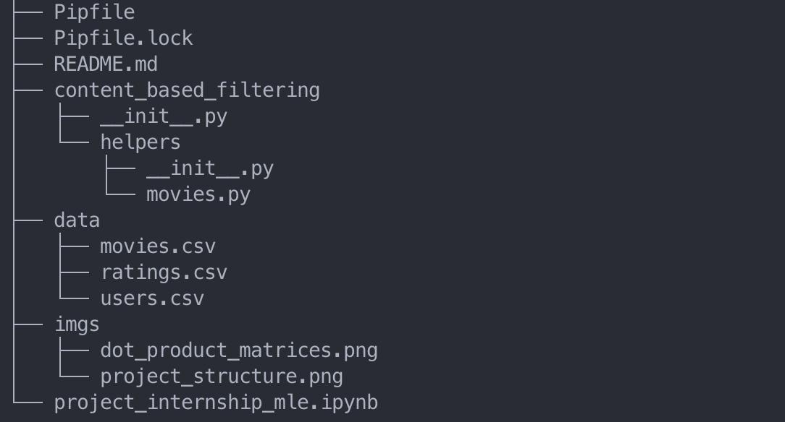

# Interview project for TinyClues MLE Internship

## Introduction

This is the interview project that any applicant to our MLE internship position receives.

The current structure is the following:


The [notebook](project_internship_mle.ipynb) holds the necessary information to complete this exercise.
In order to run it, we provide you with a jupyter-lab that you shall install following the [Setup environment section](#setup-the-environment)

The code you'll find is a naive implementation with number of shortcomings preventing 
the collaboration of multiple MLE and Data Scientists:
- It is not possible to introduce easily new functionalities mainly because the code is just a bunch of functions in one onotebook.
- The code can not be scaled to other datasets or variations of the tasks.
- There is no evaluation of the performances.
- There is no unit testing

Your main task is to refactor the code from the notebook to python files. The goal of this refactoring is to solve the shortcomings listed above. Optionally, if you have the time and some ideas of features to introduce, feel free to do so.

The projects will be evaluated on the quality of the source code produced. The closer to "clean code", the better.

## Answer modalities

We expect you to provide us with a invitation link to a fork of this repository. It shall be hosted on `github`.  
Within it, we shall find your source code and anything you think is necessary.


## Setup the environment
Run the following commands in your development environment
```bash
$ pip install pipenv
$ pipenv install
```

### Test that everything is working
Check that you can run the notebook:
```bash
$ pipenv run jupyter-lab
```
:warning: Execute every cells of the notebook just to be sure that everything is running smoothly.
